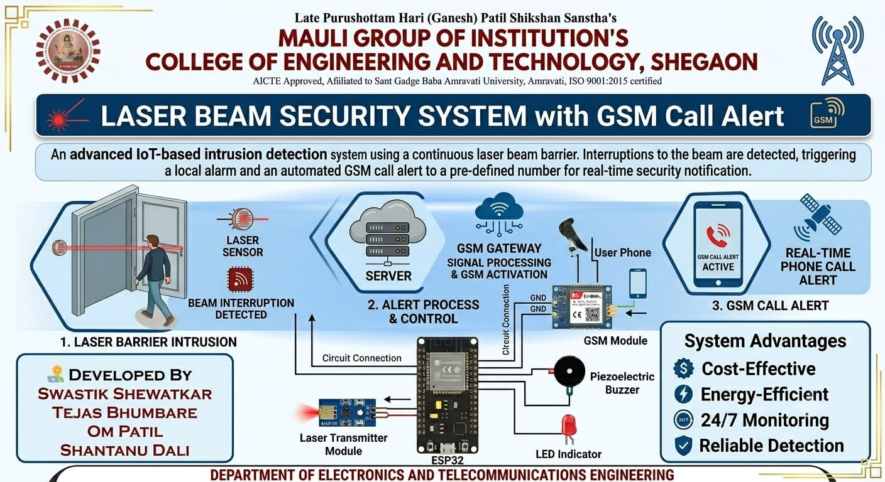
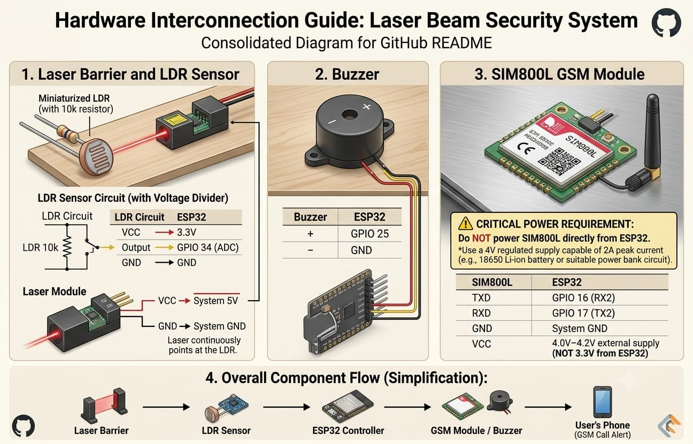
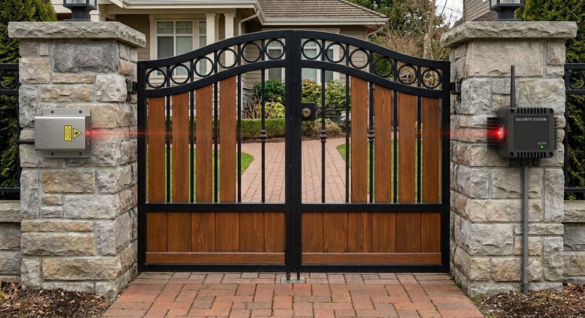

# 🚨 Laser Beam Security System with GSM Call Alert

## 📌 Overview

The Laser Beam Security System is an IoT-based intrusion detection solution developed using ESP32 and SIM800L GSM technology. The system continuously monitors a laser beam using an LDR sensor. When the beam is interrupted by an intruder, the ESP32 immediately activates an alarm and places a GSM call to the registered user.

This project demonstrates real-time security monitoring, embedded systems design, GSM communication, and sensor interfacing.

## 📸 Project Images

### Project Poster

### Hardware Connections

### Installation Example

## 💻 Technologies Used

- ESP32 Development Board
- SIM800L GSM Module
- LDR Sensor
- Laser Module
- Relay Module
- Arduino IDE
- Embedded C/C++
- GSM Communication
- 
- ## 📚 Skills Gained

- Embedded Systems Design
- ESP32 Programming
- GSM Communication
- Sensor Interfacing
- Circuit Design
- IoT Security Systems
- Hardware Troubleshooting
- Project Documentation
